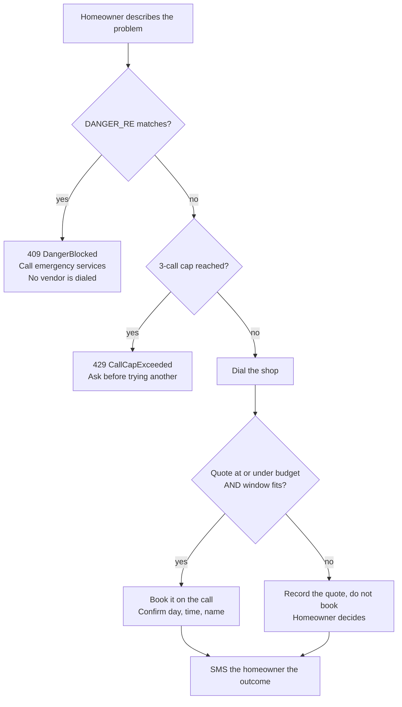
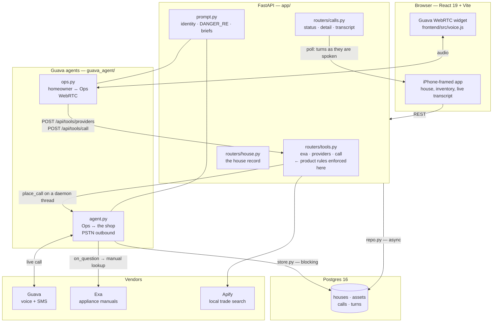
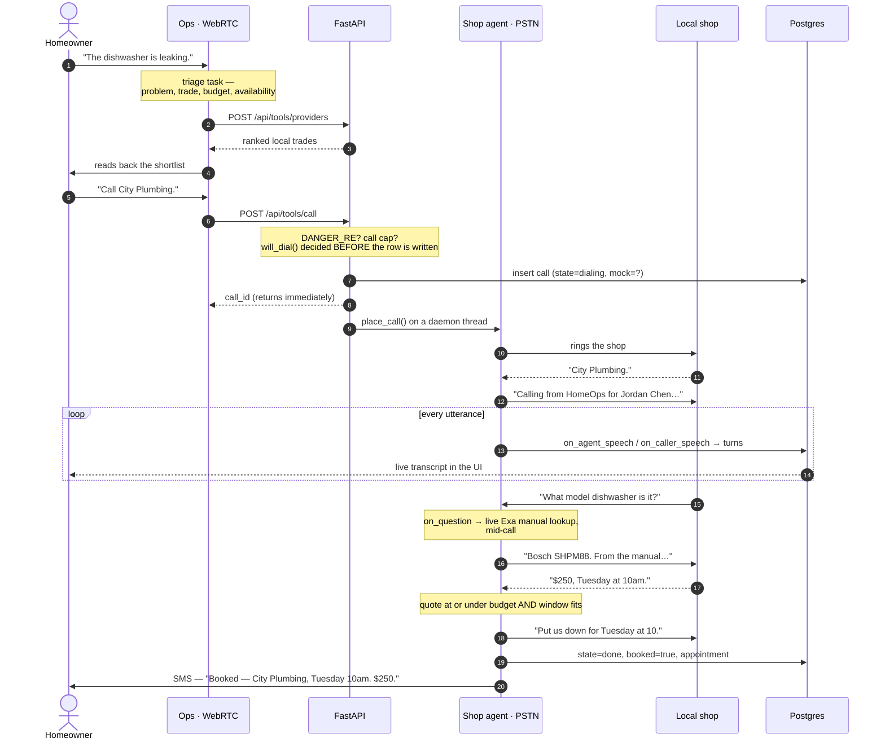

# HomeOps

**An AI house super that picks up the phone.**

You tell Ops what broke. It works out which trade you need, finds real shops
near you, **calls one on an actual phone line**, negotiates a price, and books
the visit — if the quote fits your budget and the time fits your week.

Both voice legs run on [Guava](https://goguava.ai/docs/quickstart): the
homeowner talks to Ops over WebRTC in the browser, and Ops talks to the shop
over PSTN. Same SDK, same agent primitives, two very different conversations.

---

## The problem

A dishwasher starts leaking. What actually stands between you and a fixed
dishwasher is not the repair — it's the **logistics tax**:

| The tax | What it costs you |
|---|---|
| Work out which trade this even is | plumber? appliance repair? handyman? |
| Find shops that are real, near, and open | 20 minutes of tabs and star ratings |
| Call them, one at a time, during work hours | 4 calls, 3 voicemails, 1 callback |
| Answer "what model is it?" | a trip to the basement, phone against your ear |
| Get a price, then a time, then decide | repeat per shop, hold it all in your head |

It's an hour of phone tag for a job you already knew you needed. So it waits a
week. The leak gets worse.

**Everything in that table is a phone call and a lookup — which is exactly what
an agent can do.** HomeOps is the whole errand, start to finish: triage, search,
dial, ask, quote, book, and a text message when it's done.

---

## Two rules, enforced in the backend

Both live server-side, so no client — and no prompt — can route around them.

### 1. Book within budget, never above it

Ops books **autonomously**. It does not come back with a shortlist for you to
approve; it calls down the list and puts the first shop whose quote is **at or
under your budget** and whose window **fits your availability** on the calendar.

Above budget, it still gets the number — it just doesn't book, and it says so.
The budget is a hard ceiling, not a hint.

### 2. Gas, fire, or uncontrolled flood is never a vendor call

`app/prompt.py: DANGER_RE` catches gas leaks, carbon monoxide, fire, burning
smells, burst pipes, and the phrasings people actually use under stress —
`"water is flooding and I can't stop it"`, or a bare `"I can't stop it"`.

A match returns **409 `DangerBlocked`** from `POST /api/tools/call` and Ops tells
you to call emergency services. Not a warning banner. The call never gets placed.



---

## Architecture

Two Guava agents, one FastAPI backend, one Postgres. Vendor keys never reach
the browser — the frontend talks only to FastAPI, and FastAPI talks to vendors.



**Why two database engines.** FastAPI routes are async and go through
`app/repo.py`. Guava's handlers run on plain threads with no event loop, so they
go through the blocking `app/store.py`. Same database, two engines, on purpose —
asyncpg pools bind to the loop that created them and cannot be shared.

**Why there's no webhook.** The Guava handlers write progress into Postgres
themselves as the call happens, so the UI just polls `GET /api/calls/{id}`.
Nothing has to be pushed back in.

---

## The agent architecture

The interesting design choice: **the quote is a typed checklist, not a
regex-scrape of the transcript afterwards.**

Guava's `set_task` takes a checklist of `guava.Field`s. The agent works the
checklist during the conversation and the values come back structured — so
"booked" is a real boolean the backend can trust, not a phrase someone hoped
the model would say.

```python
call.set_task(
    "quote",
    objective="Find out whether this shop can take the job, what it costs, "
              "the soonest they can come — and book it if it fits.",
    checklist=[
        guava.Field(key="can_take_job", field_type="multiple_choice",
                    choices=["yes", "no"],
                    question="Is that something you all take on?"),
        guava.Field(key="quote",
                    question="Any ballpark on what that runs?"),
        guava.Field(key="earliest_window",
                    description="Record the DAY and the TIME together — "
                                "a bare time with no day is incomplete."),
        guava.Field(key="booked", field_type="multiple_choice",
                    choices=["yes", "no"],
                    description="Book only if the quote is at or under the "
                                "budget and the window fits availability."),
        guava.Field(key="appointment", required=False,
                    description="The booked day and time as confirmed."),
    ],
    completion_criteria="Done once you know whether they can take it and, "
                        "if so, you have a price, a timeframe, and either a "
                        "booking or a reason it didn't fit.",
)
```

The budget rule is expressed the same way — as a typed field with a
`description` that states the ceiling, plus `completion_criteria` — rather than
as prose buried in a system prompt and hoped for.

### One call, end to end



Two details worth calling out:

- **`on_question` does a live Exa manual lookup mid-call.** When the shop asks
  "what model is it?", the agent looks up the real manual and answers from it.
  If `EXA_API_KEY` is unset it answers from the house record alone rather than
  reading a `[MOCK]` fixture to a real human — it never invents a spec.
- **`on_session_end` catches abrupt hangups.** Shops hang up mid-sentence. The
  session-end handler re-captures whatever the checklist already collected, so a
  quote is never lost to a dropped call.

---

## How we use Guava

Guava serves **both** voice legs. There is no second provider and no
provider-selection branch anywhere in the codebase.

| Guava primitive | Where | What it does here |
|---|---|---|
| `guava.Agent(...)` | both agents | identity, imported from `app/prompt.py` so it's stated once |
| `agent.listen_webrtc(code)` | `ops.py` | the in-app homeowner voice — widget brings its own orb, audio, signaling |
| `agent.call_phone(...)` | `agent.py` | the live outbound PSTN call to the shop |
| `agent.chat()` / `call_local()` | both | dev modes — terminal and local mic, no phone, no cost |
| `agent.roleplay(...)` | `scripts/guava_roleplay.py` | an LLM plays the shop so the whole call can be graded without dialing |
| `call.set_task(...)` + `guava.Field` | both | structured quote capture and homeowner triage |
| `completion_criteria` | `agent.py` | when the call is actually done |
| `call.set_persona(...)` | both | per-call persona, built from the job brief |
| `call.add_info(...)` | both | house record and the HomeOps rules as call context |
| `call.set_voicemail_action(...)` | `agent.py` | leaves a real callback request instead of dead air |
| `on_agent_speech` / `on_caller_speech` | `agent.py` | writes each utterance to `turns` — this is the live transcript |
| `on_question` | both | Exa manual lookup mid-call; house questions from the record |
| `on_task_complete` / `on_session_end` | both | capture, summarize, chain the next task |
| `call.send_instruction(...)` | `ops.py` | steers Ops mid-conversation after a tool result |
| `call.hangup(reason)` | `agent.py` | closes the call with the right goodbye per outcome |
| `guava.Client().send_sms(...)` | `agent.py` | post-call SMS to the homeowner |
| `guava numbers list` / `guava widget` | CLI | provisioning `GUAVA_AGENT_NUMBER` and `GUAVA_WEBRTC_CODE` |
| `guava conversations` | CLI | replaying and debugging past calls |

```bash
guava login          # CLI session — NOT enough on its own
guava numbers list   # -> GUAVA_AGENT_NUMBER
guava widget         # -> GUAVA_WEBRTC_CODE
```

`GUAVA_API_KEY` comes from the [dashboard](https://app.goguava.ai/dashboard/api-keys).
The SDK authenticates separately from the CLI and 401s without it.

---

## Safety rails

This thing dials real phones, so the defaults are paranoid.

- **`HOMEOPS_ALLOW_REAL_CALLS=0` by default.** No phone rings unless you set it
  to `1` deliberately. Calls still run end to end and return a labelled
  `[MOCK]` result. *This exists because a test run once inherited a live key
  from `.env` and rang a real phone eight times.*
- **`will_dial()` is checked before the call row is written**, so
  `POST /api/tools/call` can never report `mock: false` for a call that then
  gets suppressed. The API tells you the truth about what happened.
- **Per-number cooldown** (`HOMEOPS_CALL_COOLDOWN_SECONDS`) caps a runaway agent
  loop at exactly one dial.
- **3-call cap**, counted as rows in Postgres, so it survives a restart. The
  4th needs an explicit `try_another`.
- **`tests/conftest.py` blanks every credential and asserts it** before the
  suite runs.
- **Mocks are always visible.** Any vendor without a key returns `[MOCK]`-prefixed
  strings and `mock: true`, which propagates to a badge in the UI. You are never
  looking at a fake result that's pretending to be real.

---

## Run it

```bash
docker compose up -d                          # Postgres 16 on :5434 (required)

python3.12 -m venv .venv && source .venv/bin/activate
pip install -r requirements.txt
cp .env.example .env                          # add your Guava keys

cd frontend && npm install && npm run build && cd ..

uvicorn app.main:app --port 8000              # API + app
python -m guava_agent.ops --web               # Ops voice agent
```

Open <http://localhost:8000>.

For frontend hot-reload, run `cd frontend && npm run dev` instead of the build
(Vite proxies `/api` and `/health` to :8000) and open <http://localhost:5173>.

### Drive the shop-caller directly

```bash
python -m guava_agent.agent --chat                 # terminal, no audio, no phone
python -m guava_agent.agent --local                # your mic and speakers
python -m guava_agent.agent --phone +14155550123   # a real outbound call
```

---

## Tests

```bash
.venv/bin/python -m pytest tests/ -q               # 58 tests
```

Runs against a throwaway `homeops_test` database with every credential blanked,
so the suite physically cannot place a call. Coverage is aimed at the rules that
matter: `test_product_rules.py`, `test_call_safety.py`, `test_honesty.py`.

```bash
python scripts/guava_roleplay.py                      # an LLM plays the shop
python scripts/guava_roleplay.py --scenario busy      # booked out three weeks
python scripts/guava_roleplay.py --scenario wrong-number
```

`agent.roleplay()` runs the full call with an LLM playing the shop — no phone,
no cost — and grades the transcript against a rubric.

> **Known stale:** the rubric still fails the agent for booking, which was the
> old product rule. Under the current rule the agent *should* book within
> budget, so the `quote` scenario needs its rubric updated to assert the budget
> ceiling instead. Tracked, not yet done.

---

## API surface

| Method | Route | Purpose |
|---|---|---|
| `POST` | `/api/tools/exa` | appliance manual lookup |
| `POST` | `/api/tools/providers` | local trade search |
| `POST` | `/api/tools/call` | place the outbound quote call — **both rules enforced here** |
| `GET` | `/api/calls` | call history |
| `GET` | `/api/calls/{id}` | cheap status poll |
| `GET` | `/api/calls/{id}/detail` | structured fields + transcript |
| `GET` | `/api/calls/{id}/transcript` | turns alone |
| `GET`/`PATCH` | `/api/house` | the house record |
| `POST`/`PATCH`/`DELETE` | `/api/house/assets` | inventory |
| `POST` | `/api/voice/web` | mint an Ops session |

Errors are typed, not generic: **503** `VendorNotConfigured`, **502**
`VendorError`, **409** `DangerBlocked`, **429** `CallCapExceeded`. Full contract
in [`docs/API.md`](docs/API.md).

---

## Layout

```
app/               FastAPI — db.py (Postgres), repo.py (async), store.py (blocking)
  prompt.py        single source of identity, DANGER_RE, brief → call variables
  routers/         tools · calls · house · voice · live
  services/        guava_caller · exa · apify
guava_agent/
  agent.py         the outbound shop-quote caller (PSTN)
  ops.py           the homeowner-facing agent (WebRTC)
frontend/          React 19 + Vite, served from frontend/dist
scripts/           guava_roleplay.py — graded call sim, no phone
docs/API.md        the API contract
spec/              requirements → design → tasks
```

Deployed on Render: one Python service, `scripts/render-build.sh` installs deps
and builds the Vite bundle into `frontend/dist`, which `app/main.py` serves
behind an SPA catch-all. Health check at `/health`.
