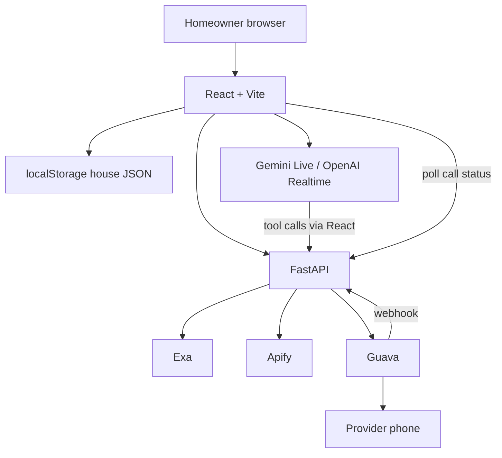
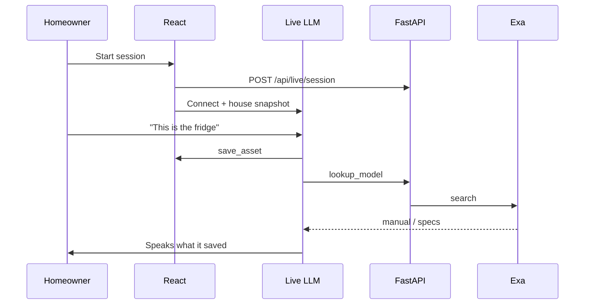
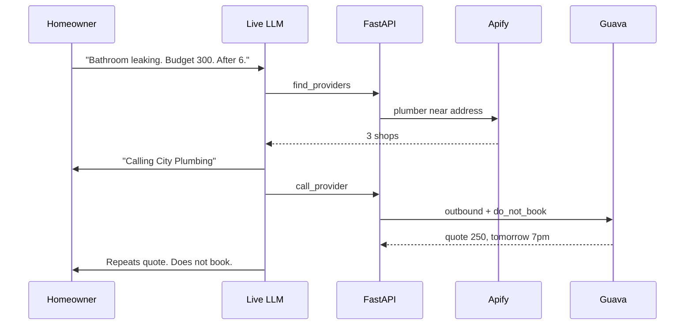

# Design Document

## Overview

**HomeOps** is a hackathon app: **React + Vite** for the UI, **FastAPI** for tools. The browser talks to a **live multimodal LLM**. That session is the product — inventory, diagnosis, and “go call someone” happen by voice and camera. Tools do the rest (Exa, Apify, Guava).

No auth. No ElevenLabs. No booking.

House state lives in the browser's `localStorage`. FastAPI still runs vendor tools so API keys stay on the server.

**Flow preview:** `cd frontend && npm run dev` (http://localhost:5173). Vite proxies `/api` to FastAPI on port 8000. For a single process, `npm run build` and FastAPI serves `frontend/dist`.

### Design goals

- Judges see a camera, hear HomeOps, watch a phone call.
- House memory is a JSON blob the live model is given as context.
- Failures show up in an activity log; HomeOps does not invent quotes.

### Key design decisions

| Decision | Choice | Why |
| --- | --- | --- |
| Backend | **FastAPI + uvicorn** | Python, quick routes, easy vendor SDKs. |
| Frontend | **React + Vite** | Same House / Live / Work flow; proxy `/api` in dev. |
| Identity | None | Laptop demo. |
| Persistence | localStorage | Survive refresh; no server, no accounts. |
| Live agent | **Gemini Live** (default) or **OpenAI Realtime** | Voice; Gemini Live also takes video. |
| Model lookup | Exa tool | Manuals / specs. |
| Local pros | Apify Maps/Google actor | Name, rating, phone. |
| Outbound call | Guava | Ask for quote + window. **Do not book.** |
| Voice in the UI | The live LLM | No ElevenLabs. |

---

## Architecture



The live model never holds Exa / Apify / Guava keys. The page forwards tool calls to FastAPI.

### Repo layout

```
homeops/
  spec/
  frontend/                 # React + Vite
    src/App.jsx
    src/index.css
    vite.config.js          # proxies /api → :8000
  app/
    main.py                 # FastAPI; optional mount of frontend/dist
    config.py
    routers/
      live.py
      tools.py
      calls.py
    services/
      exa.py
      apify.py
      guava.py
  requirements.txt
  .env.example
```

### Stack

| Piece | Tech |
| --- | --- |
| HTTP | FastAPI, uvicorn |
| UI | React 19 + Vite 7 |
| Live session | Gemini Live **or** OpenAI Realtime (browser WebRTC; FastAPI mints token) |
| Tools | FastAPI routes under `/api` |
| Data | `HouseState` in `localStorage` |
| Call status | in-memory `dict` on the FastAPI process |

Dev: `uvicorn` on 8000 + `npm run dev` on 5173.  
Prod-ish: `npm run build`; FastAPI serves `frontend/dist` on `0.0.0.0:$PORT`.

---

## Screens (confirm with `npm run dev` in `frontend/`)

Three screens, one page. Tabs, not a wizard — HomeOps stays in one live session while the homeowner glances at House / Live / Work.

| Screen | What you confirm |
| --- | --- |
| **House** | Address, rooms, drawing upload, inventory list |
| **Live** | Camera preview, start/stop, captions, typed fallback |
| **Work** | Activity log, provider cards, call state, quotes — **no Book button** |

Demo path through those screens: House (seed the place) → Live (save a fridge, say the bathroom is leaking) → Work (three plumbers, one call, a number comes back).

---

## Components

### 1. FastAPI app

```python
# app/main.py (shape)
from fastapi import FastAPI
from fastapi.staticfiles import StaticFiles
from fastapi.responses import FileResponse

app = FastAPI(title="HomeOps")
app.include_router(live.router, prefix="/api")
app.include_router(tools.router, prefix="/api")
app.include_router(calls.router, prefix="/api")

@app.get("/health")
def health():
    return {"ok": True}

app.mount("/", StaticFiles(directory="frontend/dist", html=True), name="ui")
```

Register API routes first. In development, do not mount `dist`; use Vite and the `/api` proxy instead.

### 2. House state (client)

```ts
type HouseState = {
  address: string
  rooms: { id: string; name: string }[]
  drawings: { id: string; name: string; roomId?: string; dataUrl: string }[]
  assets: Asset[]
}

type Asset = {
  id: string
  roomId: string
  category: string
  brand?: string
  model?: string
  serial?: string
  photoDataUrl?: string
  exaSummary?: string
  exaUrl?: string
}
```

Resize images before save (`localStorage` quota). On session start, send a **text** snapshot of the house (not giant data URLs) plus the live camera.

### 3. Live session (browser + mint route)

FastAPI `POST /api/live/session` returns an ephemeral token for `LIVE_PROVIDER=gemini|openai`.

The React app starts WebRTC / Gemini Live with system prompt:

> You are HomeOps, a house super. You can see the camera. Save appliances when confident. If something is broken, gather budget and availability, then use tools to find and call providers. You never book an appointment. On calls you identify as HomeOps, an AI assistant. If gas/fire/uncontrolled flood, tell them to call emergency services.

| Tool | Where it runs | Result |
| --- | --- | --- |
| `save_asset` | browser (`HouseState`) | `{ id }` |
| `lookup_model` | FastAPI → Exa | summary + url |
| `find_providers` | FastAPI → Apify | `{ name, rating, phone }[]` |
| `call_provider` | FastAPI → Guava | `{ callId }` |
| `get_call_status` | FastAPI memory | `{ state, summary, quote? }` |

### 4. Job brief (not a booking)

```python
class JobBrief(BaseModel):
    address: str
    problem: str
    trade: str
    budget: str | None = None
    availability: str | None = None
    asset: str | None = None
    drawings_note: str | None = None
    do_not_book: Literal[True] = True
```

Guava prompt: ask price and earliest window, write them down, **do not schedule**. Identify as HomeOps.

Hack night: dial a **verified test number** unless a real shop is in play.

---

## HTTP API

| Method | Path | Body / result |
| --- | --- | --- |
| GET | `/health` | `{ ok: true }` |
| POST | `/api/live/session` | `{ client_secret, expires_at, provider }` |
| POST | `/api/tools/exa` | `{ query }` → `{ summary, url? }` |
| POST | `/api/tools/providers` | `{ trade, address }` → `{ providers }` |
| POST | `/api/tools/call` | `{ phone, brief }` → `{ call_id }` |
| POST | `/api/guava/webhook` | Guava event → update memory |
| GET | `/api/calls/{id}` | `{ state, summary?, quote? }` |

No auth. Local demo only.

---

## Flows

### Inventory



### Leak / fridge / reno



---

## Correctness properties

1. **No booking** — no booked slot, no “you’re confirmed.” **Req 7.6, 8.4**
2. **Inventory is spoken-back fact** — list updates only after `save_asset`. **Req 2.3, 2.4**
3. **Context is the house** — live session gets inventory + drawings text. **Req 4.2**
4. **Call cap** — at most 3 outbound calls unless the user asks. **Req 7.7**
5. **Identity** — Guava prompt is HomeOps, AI house super. **Req 7.2**
6. **Danger** — no vendor call on gas/fire/uncontrolled flood. **Req 5.4**

---

## Errors

| Failure | Behavior |
| --- | --- |
| Live connect fail | Message on Live screen; typed chat still works |
| Exa down | Keep asset, say lookup failed |
| Apify empty | Say no callable shops |
| Guava fail | Activity error, offer next shop |
| Missing env | `/health` can stay up; tool routes return a named missing key |

---

## Testing

- `save_asset` updates inventory JSON.
- Providers mock: 3 phones; prefer rating.
- Call prompt contains “do not book” and “HomeOps”.
- Danger phrase does not invoke `call_provider`.

---

## Env

```
LIVE_PROVIDER=gemini
GEMINI_API_KEY=
OPENAI_API_KEY=
EXA_API_KEY=
APIFY_TOKEN=
GUAVA_API_KEY=
GUAVA_AGENT_NUMBER=
GUAVA_API_KEY=
PORT=8000
```

---

## Traceability

| Reqs | Design |
| --- | --- |
| 1, 4, 9 | House / Live / Work React screens |
| 2, 5, 10 | Live session + FastAPI mint |
| 3 | Exa route |
| 6 | Apify route |
| 7, 8 | Guava + job brief + no-book prompt |
| 10.4 | uvicorn `0.0.0.0:$PORT` |
